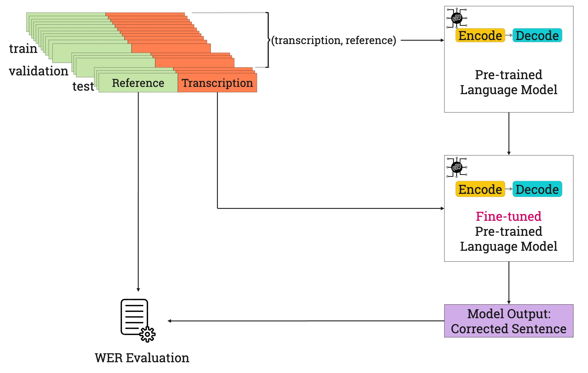

# Clinical Dialogue Transcription Error Correction Using Seq2Seq Models

## Overview
This work introduces a seq2seq learning approach for clinical dialogue transcription error correction. Given the limited availability of clinical dialogue data, we proposed a method that leverages publicly available medical domain data, such as PubMed, to fine-tune a large language model (LLM) in a self-supervised manner. This approach allows for effective adaptation of general-purpose seq2seq models to the specific needs of transcription error correction in the clinical domain.



## Experiment Setup

This project evaluates different varients of two pre-trained language models, [T5](https://dl.acm.org/doi/abs/10.5555/3455716.3455856) and [BART](https://aclanthology.org/2020.acl-main.703).

The models were fine-tuned using the [Hugging Face](https://huggingface.co) and [PyTorch](https://pytorch.org) libraries with default hyperparameters. For the summarisation task, encoder input and decoder output sequence lengths were set to 1024 and 128, respectively. For paraphrasing and mask-filling tasks, both encoder and decoder sequence lengths were set to 512.

## Datasets

The `train` data consists of PubMed abstracts generated for three self-supervision tasks (summarisarion, paraphrasing and masking). 
The `test` data contains role-playing clinical conversations provided by NHS Grampian (available upon request). 

Note: The fine-tuned models and the train dataset are available on Hugging Face as part of a collection (https://huggingface.co/collections/gayanin/ec-seq2seq-670bf24153dcd91dc51b5c5a). To access and use them, visit the collection and download or load the models and datasets directly into your environment.

## Configuration

Configurations for models, evaluation scenarios, objectives, and training settings are defined in `config.yml`. This makes it easy to adjust scenarios, objectives, or model paths without modifying code.

## Reproduce Results

### 1. Install Dependencies

Run the following command to install the required libraries:

```bash
pip3 install -r requirements.txt  
```

### 2. Fine-tune Models

To train models with specific configurations:

```bash
python scripts/run_training.py --model_type bart --model_size base --objective summarisation
```

This will initialize and train the specified model based on configurations in `config.yml`.

### 3. Evaluate All Scenarios

The `run_all_evaluations.py` script iterates through scenarios specified in `config.yml`, calculating the Word Error Rate (WER) for each.

```bash
python scripts/run_all_evaluations.py
```

The script:
- Loads each scenario from `config.yml`.
- Runs predictions for each model and objective.
- Saves the WER score and predictions for each scenario in `results/`.

### 4. Output

- **Prediction Files**: Individual predictions for each scenario are saved in `results/`.
- **Summary File**: The WER scores for all scenarios are saved in `evaluation_summary.csv` in `results/`.

## Citation
```
 @article{Nanayakkara2023,
    title = {Clinical Dialogue Transcription Error Correction Using Seq2Seq Models},
    author = {Nanayakkara, Gayani and Wiratunga, Nirmalie and Corsar, David and Martin, Kyle and Wijekoon, Anjana},
    bookTitle="Multimodal AI in Healthcare: A Paradigm Shift in Health Intelligence",
    year="2023",
    publisher="Springer International Publishing",
    doi="10.1007/978-3-031-14771-5_4"
}
```

